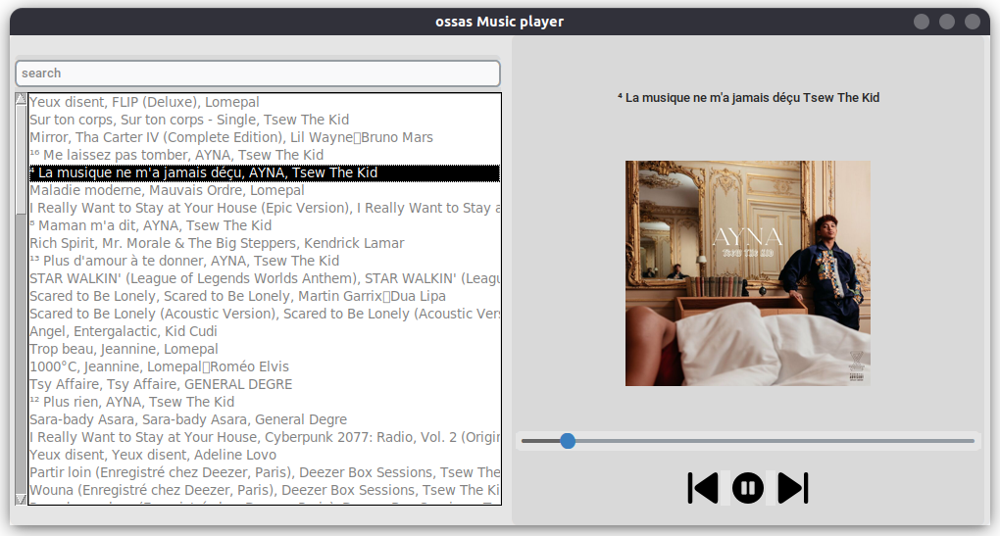

# OSAS Player



A simple music player built with Python and Rust.

---

## Installation

1. Clone the repo:
   ```bash
   git clone --recurse-submodules https://github.com/j03-dev/osas-player.git
   cd osas-player
   ```

2. Install Python dependencies:
   ```bash
   python -m pip install -r requirements.txt
   ```

---

## Configuration

1. Open `.config` and set your music directory:
   ```
   path = /path/to/your/music
   ```

---

## Build Rust Library

1. Install [Rust](https://www.rust-lang.org/tools/install) if you don’t have it.
2. Build the library:
   ```bash
   cd osas
   maturin develop
   ```

---

## Run the Player

```bash
python src/main.py
```


